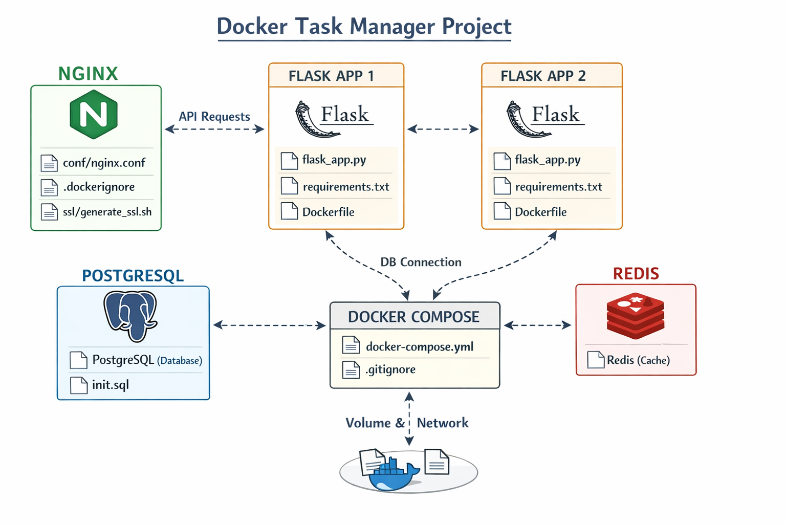

## Project Architecture




# Docker Task Manager Project

This project runs a Task Manager web application using Docker.

## Technologies Used

- Nginx (Reverse Proxy + HTTPS)
- Flask (2 instances for load balancing)
- PostgreSQL (Database)
- Redis (Caching / Health check)
- Docker & Docker Compose

## Architecture

User → Nginx → Flask1 / Flask2 → PostgreSQL + Redis

## How to Run

```bash
docker compose up -d --build
